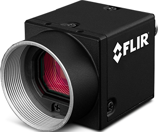

# RxLIVE_handheld
## 1. Introduction
This repository provides the CAD files of our handheld device, which is used for sampling data for  [R2LIVE](https://github.com/hku-mars/r2live), [R3LIVE](https://github.com/hku-mars/r3live) and [r3live dataset](https://github.com/ziv-lin/r3live_dataset). 
In this repo, all of the modules are capable of [*FDM (Fused Deposition Modeling)*](https://en.wikipedia.org/wiki/Fused_filament_fabrication) printable. 

We release the all of our schematic files with STL files format (under the “release” directory), which can be imported and printed directly. Moreover, we also release the CAD source files (with suffix “\*.SLDPRT and \*.SLDASM”), which can be opened and edited with [*Solidworks*](https://www.solidworks.com).

**Designer**: [Jiarong Lin](https://github.com/ziv-lin) and [Xiyuan Liu](https://github.com/samsdolphin)
<div align="center">

</div>

## 2. Guide to installation
### 1.1 Assembly instruction
The assembly instructions are shown in the following figure, where we mark each module correspondingly with the name of each STL files.

<div align="center">

</div>


### 1.2 Electronic connection
The guide of electronic connection is shown as follow:
<div align="center">
    
</div>

## 3. Open and edit the source files
If you have installed [*Solidworks*](https://www.solidworks.com) on your computer, we strongly recommand you to see more details by openning the assembly file ("**RxLIVE_handheld.SLDASM**").

## 4. Material lists (only for reference)
| Item  | Pics  | Purchasing list <br> (available is <br>  not guaranteed)  |
| :------------: | :------------: | :------------: |
| Livox Avia LiDAR  |   | [Livox tech](https://www.livoxtech.com/); [DJI store](https://store.dji.com/hk-en/product/livox-avia) |
| Phantom 4 Intelligent <br>  Flight Battery  |  |   [DJI](https://store.dji.com/product/phantom-4-pro-intelligent-battery-high-capacity?from=search-result-v2&position=1)|
| FLIR camera <br> Blackfly BFS-u3-13y3c|  | [FLIR](https://www.flir.com/)|
| Camera lens |  | [TaoBao](https://item.taobao.com/item.htm?spm=a1z09.2.0.0.513c2e8daXJAWH&id=574262885542&_u=srntq1l7258) |
| Battery power <br> management unit |  | [TaoBao](https://item.taobao.com/item.htm?spm=a1z09.2.0.0.67002e8damYNUc&id=530629049456&_u=6rntq1l7cf6) |
| DJI D-GPS RTK <br> **(Optional)**  |  | [DJI](https://www.dji.com/hk-en/d-rtk) |


## 5. License
The source code is released under [GPLv2](http://www.gnu.org/licenses/) license. 

If you use any code of this repo in your academic research, it will be **very very appreciated** if you can cite any of our following papers:
```
[1] Lin, Jiarong, and Fu Zhang. "R3LIVE: A Robust, Real-time, RGB-colored, LiDAR-Inertial-Visual tightly-coupled state Estimation and mapping package." 
[2] Lin, Jiarong, et al. "R2LIVE: A Robust, Real-time, LiDAR-Inertial-Visual tightly-coupled state Estimator and mapping." 
```
For any technical issues, please contact me via email Jiarong Lin < ziv.lin.ljr@gmail.com > 

For commercial use, please contact Dr. Fu Zhang < fuzhang@hku.hk > and me < ziv.lin.ljr@gmail.com >.